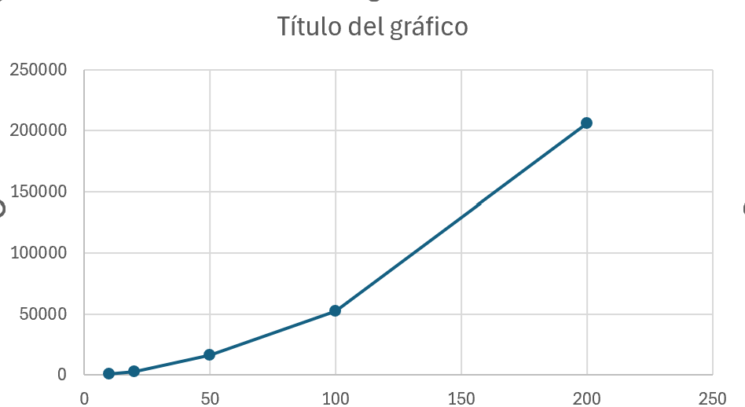

# Informe Técnico

## Knapsack Problem (0/1)

### Intruduccion

El "Knapsack problem" es un problema donde se debe averiguar cual es la eleccion de objetos donde mas valor se puede obtener al momento de elegir entre un conjunto de estos mismos, cada uno teniendo su respectivo peso y valor asociado.

en este caso, se debe elegir entre si tomar o no un objeto **(0/1)**.

Para nuestro caso debemos encontrar cual es la mejor combinacion en cuanto a valor de objetos que puede tener un vehiculo con una capacidad maxima permitida para entregar recursos a una zona afectada por un desastre natural

### **Diseño de la solución: Descripción de estados y recurrencia utilizada**

La solucion implementa el problema de la **mochila 0/1 (0/1 Knapsack)** utilizando **programacion dinamica**. Se construye una tabla `dp` de tamaño `(n + 1) × (C + 1)`, (Para evitar los casos base) donde `n` corresponde a la cantidad de objetos y `C` a la capacidad maxima de la mochila.

Cada estado dp[i][w] representa el **valor maximo que puede obtenerse utilizando los primeros `i` objetos con una capacidad disponible de `w`**.

#### Casos base

Se consideran dos casos base:

* `dp[0][w] = 0` para toda capacidad `w`, ya que sin objetos no es posible obtener valor.
* `dp[i][0] = 0` para cualquier cantidad de objetos `i`, ya que con capacidad cero no se puede transportar objetos.

#### Recurrencia

Para cada objeto `i` con peso "i" y valor "i", se evaluan dos posibilidades:

* **No incluir el objeto**, conservando el mejor valor obtenido hasta el objeto anterior:

  >dp[i-1][w]

* **Incluir el objeto**, siempre que su peso no exceda la capacidad disponible:

  >valor_i + dp[i-1][w - peso_i]

Por lo tanto, la recurrencia utilizada es:

"Si peso_i ≤ w entonces, se usara la siguiiente forma"

  `dp[i][w] = max(dp[i-1][w], valor_i + dp[i-1][w - peso_i])`

O de lo contrario

  `dp[i][w] = dp[i-1][w]`

Una vez completada la tabla, el resultado óoptimo corresponde a **dp[n][C]** (Celda final). Ademas, para obtener los objetos seleccionados, se realiza un recorrido inverso desde esa posicion, comparando cada estado con el de la fila anterior. Si ambos valores son iguales, entonces el objeto no fue seleccionado, en caso contrario, el objeto forma parte de la solución y se descuenta su peso de la capacidad restante. 


### Resultados

#### Grafico resultante:


#### Salida generada para la prueba de Benchmarking

```bash
========== EXPERIMENTO ==========


[!]====== 10 ITEMS =====[!]
Cantidad de items: 10
Capacidad de la mochila: 30
Tiempo de ejecucion: 914 ns (9.14E-4 ms)
Dimensiones de la matriz: 11x31 (Total de celdas: 341)
Valor optima encontrado: 229

[!]====== 20 ITEMS =====[!]
Cantidad de items: 20
Capacidad de la mochila: 60
Tiempo de ejecucion: 3008 ns (0.003008 ms)
Dimensiones de la matriz: 21x61 (Total de celdas: 1281)
Valor optima encontrado: 689

[!]====== 50 ITEMS =====[!]
Cantidad de items: 50
Capacidad de la mochila: 150
Tiempo de ejecucion: 16226 ns (0.016226 ms)
Dimensiones de la matriz: 51x151 (Total de celdas: 7701)
Valor optima encontrado: 2245

[!]====== 100 ITEMS =====[!]
Cantidad de items: 100
Capacidad de la mochila: 300
Tiempo de ejecucion: 52228 ns (0.052228 ms)
Dimensiones de la matriz: 101x301 (Total de celdas: 30401)
Valor optima encontrado: 4996

[!]====== 200 ITEMS =====[!]
Cantidad de items: 200
Capacidad de la mochila: 600
Tiempo de ejecucion: 205742 ns (0.205742 ms)
Dimensiones de la matriz: 201x601 (Total de celdas: 120801)
Valor optima encontrado: 9586

=================================
```


### Analisis

Para nuestro caso, el experimento muestra que la complejidad del "tiempo de ejecucion" aumenta de forma gradual a medida que crecen la cantidad de objetos y la capacidad de la mochila. Esto siendo congruente con la complejidad teorica esperada

> O(n × C)

Para añadir, el tamaño de la matriz dp tambien aumenta de manera proporcional a lo teorico "O(n × C)", lo que tambien coincide con la complejidad de memoria esperada. Esto se puede observar en las pruebas realizadas, que al momento de duplicar aproximadamente la cantidad de objetos y la capacidad, el numero de celdas de la matriz crece de manera similar a la mostrada en el tiempo de ejecucion, confirmando el comportamiento esperado del algoritmo.

### Conclusiones

Para este laboratorio, se ha comprobado que la programación dinamica es util para resolver problemas como el "knapsack problem" de manera eficaz, de esta manera evitando calculos excesivos y repetidos gracias a el almacenamiento de resultados previamente hechos. Ademas, se ha observado que tanto el tiempo de ejecucionm, como el uso de memoria aumentan de acuerdo con el tamaño de la tabla dp, coincidiendo de esta manera con la complejidad teorica del algoritmo.